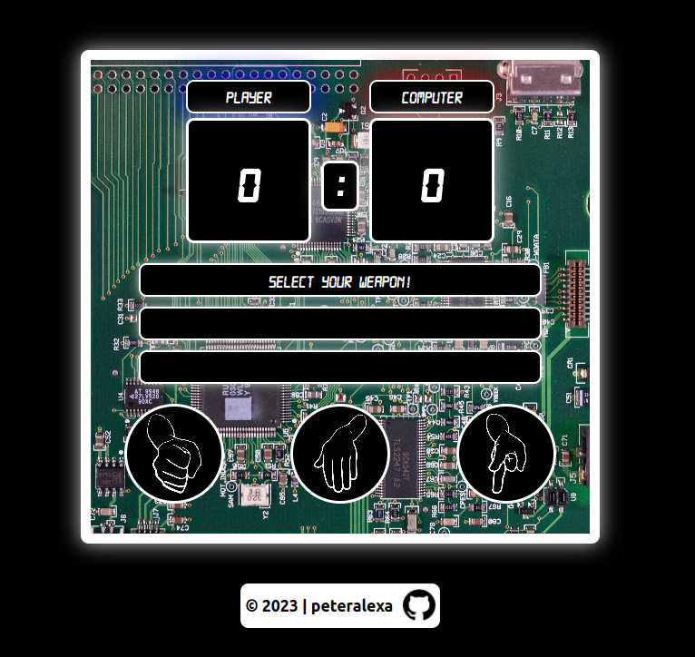

# Rock-Paper-Scissors Game

This is a simple web-based implementation of the classic rock-paper-scissors game, created using JavaScript as part of The Odin Project.

## Live Preview

Check out the live preview of the game [here](https://peteralexa.github.io/top-rock-paper-scissors/).

  

## Usage

To play the game, simply click on one of the three buttons - Rock, Paper, or Scissors. Your selection will be displayed on the interface, and the computer's choice will be randomly generated. The outcome of the round will be displayed, and the scores will be updated accordingly.

The game continues until either the player or the computer reaches a score of 5. When the game is over, a screen will display the winner, and you can choose to play again by clicking the "PLAY AGAIN!" button.

## Assets and Credits

- **Font**: The game uses the Digital-7 Font Family, created by Avatar: Style-7. You can find it [here](https://www.1001fonts.com/digital-7-font.html).

- **Background Image**: The motherboard background was created by Miguel Á. Padriñán and can be found on [pexels.com](https://www.pexels.com/photo/green-circuit-board-343457/).

- **Button Icons**: The rock, paper, and scissors icons used in the game are sourced from [pixabay.com](https://pixabay.com/). You can find them here:
  - Rock: [Rock Hand](https://pixabay.com/vectors/rock-paper-scissors-rock-hand-296854/)
  - Paper: [Paper Hand](https://pixabay.com/vectors/rock-paper-scissors-paper-hand-296855/)
  - Scissors: [Scissors Hand](https://pixabay.com/vectors/rock-paper-scissors-scissors-hand-296853/)

Feel free to explore the live preview and enjoy a classic game of rock-paper-scissors!
